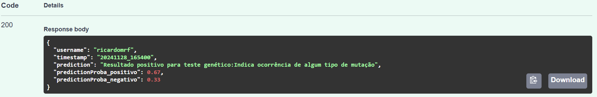
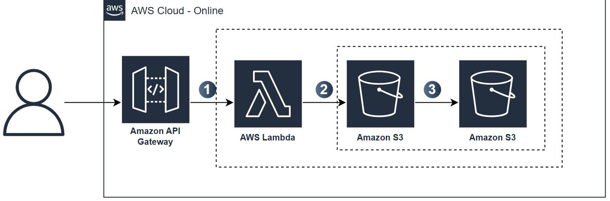
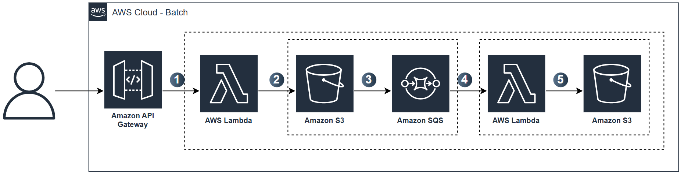

<a href="https://github.com/RicardoMourao-py/mlops-predict-online-or-batch/actions/workflows/cicd.yaml" target="_blank"></a>

# Calculadora de Risco Genético (MLOps)
Este projeto segue práticas de MlOps para predições em lote ou em tempo real, focado em um modelo que calcula o risco genético baseado em histórico hereditário do usuário. Para mais informações, acesse o [link](model/README.md).

## Acesse a API

A api está disponível publicamente no link abaixo:
https://8goepcjo9c.execute-api.us-east-2.amazonaws.com/docs


Para ter acesso ao token de autenticação, entre em contato com ricardomrf@al.insper.edu.br

## Executando a API

Caso não use a interface e prefira executar a api por invocação, use a seguinte chamada:

> [!WARNING]
> Observe que os campos abaixo devem ser preenchidos.
> - **PREDICT_TYPE**: tipo da predição. Pode ser `predict-online` ou `predict-batch`.
> - **USER_NAME**: Crie um username. (Ex: ricardomrf)
> - **TOKEN**: Entre em contato com o responsável.

```
curl -X 'POST' \
  'https://8goepcjo9c.execute-api.us-east-2.amazonaws.com/{PREDICT_TYPE}?username={USER_NAME}' \
  -H 'accept: application/json' \
  -H 'Authorization: Bearer {TOKEN}' \
  -H 'Content-Type: application/json' \
  -d '{
  "vc_tem_lesao_atualmente": 1,
  "idade_inicio_problema_atual": 1,
  "onde_lesao": 1,
  "tipo_cancer_paciente": 1,
  "algum_filho_tem_ou_teve_cancer": 1,
  "tipo_cancer_filho": 1,
  "pai_tem_ou_teve_cancer": 1,
  "tipo_cancer_pai": 1,
  "mae_tem_ou_teve_cancer": 1,
  "tipo_cancer_mae": 1,
  "avo_paterno_tem_ou_teve_cancer": 1,
  "tipo_cancer_avo_paterno": 1,
  "avo_paterna_tem_ou_teve_cancer": 1,
  "tipo_cancer_avo_paterna": 1,
  "avo_materno_tem_ou_teve_cancer": 1,
  "tipo_cancer_avo_materno": 1,
  "avo_materna_tem_ou_teve_cancer": 1,
  "tipo_cancer_avo_materna": 1
}'
```

> [!NOTE]
> Para entender como preencher as informações contidas no body da requisição, leia o seguinte [dicionário de dados](model/simulator/README.md#dicionario-de-dados).

**Output**:


## Como contribuir

Existem duas formas de contribuir: Melhorando a API ou melhorando o Modelo.

### Melhorando a API
O arquivo [main.py](main.py) tem todas funções necessárias para a implementação da API

1. Com o repositório atualizado, crie sua branch a partir da branch `main`. 

2. Faça suas alterações no arquivo [main.py](main.py).

3. Suba suas alterações e crie um Pull Request. 

Estando tudo Ok, suas alterações serão aprovadas e implementadas via CI/CD.

### Melhorando o Modelo

Existem três arquivos que podem ser alterados: [data_simulator.py](model/simulator/data_simulator.py), [mock_model.py](model/mock_model.py) e [train.py](model/train.py). Sendo assim:

1. Com o repositório atualizado, crie sua branch a partir da branch `main`. 

2. Faça suas alterações nos arquivos necessários.

3. Suba suas alterações e crie um Pull Request. 

Estando tudo Ok, suas alterações serão aprovadas e implementadas via CI/CD.

## Infraestrutura
Quando consultamos a api percebemos que é possível dois tipos de predição: em batch e on-line. 

A previsão on-line é quando as previsões são geradas e retornadas assim que as solicitações para essas previsões são recebidas pelo serviço. A principal vantagem da previsão online é que ela facilita o fornecimento de uma experiência de usuário em tempo real.

Enquanto isso, a previsão em batch (lote) é adequada para tarefas preditivas que não são em tempo real. Sendo assim, é possível processar e prever valores para grandes quantidades de dados em simultâneo. Ou seja, um modelo de aprendizado de máquina pode prever resultados para um conjunto de dados (lote) de uma vez, aumentando a eficiência em comparação com a previsão individual de cada ponto de dados.
## Arquitetura de Predição Online


## Arquitetura de Predição em Batch
