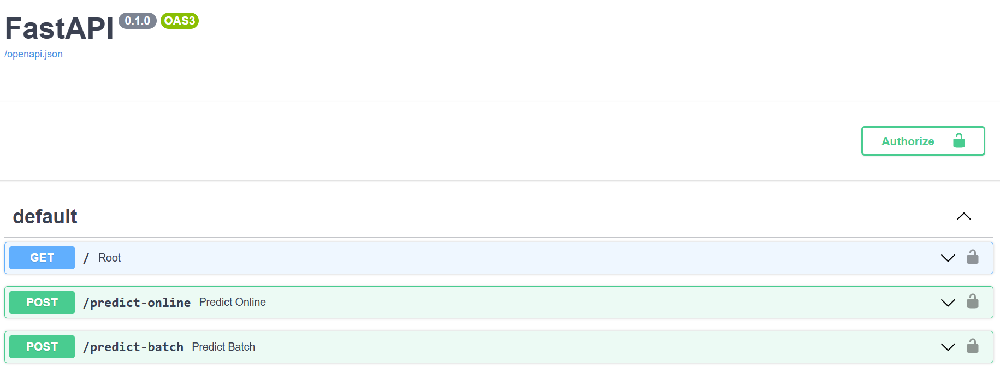

# Calculadora de Risco Genético (MLOps)
Este projeto segue práticas de MlOps para predições em lote ou em tempo real, focado em um modelo que calcula o risco genético baseado em histórico hereditário do usuário. Para mais informações, acesse o [link](https://github.com/RicardoMourao-py/Cancer-Risk-Calculator).

## Acesse a API

A api está disponível publicamente no link abaixo:
https://8goepcjo9c.execute-api.us-east-2.amazonaws.com/docs



Para ter acesso ao token de autenticação, entre em contato com ricardomrf@al.insper.edu.br

## Executando a API

Caso não use a interface e prefira executar a api por invocação, use a seguinte chamada:

> [!WARNING]
> Observe que os campos abaixo devem ser preenchidos.
> - PREDICT_TYPE: tipo da predição. Pode ser `predict-online` ou `predict-batch`.
> - USER_NAME: Crie um username. (Ex: ricardomrf)
> - TOKEN: Entre em contato com o responsável.

```
curl -X 'POST' \
  'https://8goepcjo9c.execute-api.us-east-2.amazonaws.com/{PREDICT_TYPE}?username={USER_NAME}' \
  -H 'accept: application/json' \
  -H 'Authorization: Bearer {TOKEN}' \
  -H 'Content-Type: application/json' \
  -d '{
  "vc_tem_lesao_atualmente": 1,
  "idade_inicio_problema_atual": 1,
  "onde_lesao": 1,
  "tipo_cancer_paciente": 1,
  "algum_filho_tem_ou_teve_cancer": 1,
  "tipo_cancer_filho": 1,
  "pai_tem_ou_teve_cancer": 1,
  "tipo_cancer_pai": 1,
  "mae_tem_ou_teve_cancer": 1,
  "tipo_cancer_mae": 1,
  "avo_paterno_tem_ou_teve_cancer": 1,
  "tipo_cancer_avo_paterno": 1,
  "avo_paterna_tem_ou_teve_cancer": 1,
  "tipo_cancer_avo_paterna": 1,
  "avo_materno_tem_ou_teve_cancer": 1,
  "tipo_cancer_avo_materno": 1,
  "avo_materna_tem_ou_teve_cancer": 1,
  "tipo_cancer_avo_materna": 1
}'
```

> [!NOTE]
> Para entender como preencher as informações contidas no body da requisição, leia o seguinte [dicionário de dados]().